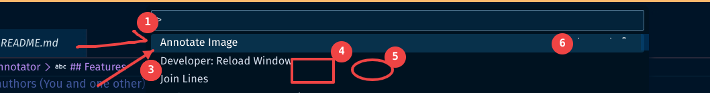
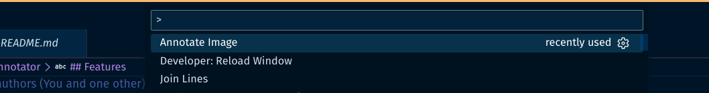

# Image Annotator

**Image Annotator** is a VS Code extension that allows you to quickly annotate images (screenshots, diagrams) and analyze them using Google's Gemini AI directly within your IDE.

## Features

*   **📋 Paste & Annotate:** Paste images directly from your clipboard or upload them from your disk.
*   **✏️ Rich Annotation Tools:** Use arrows, rectangles, circles, text, counters, and a pixelate/blur tool to highlight or redact information.
     
    
*   **🤖 AI Analysis:** Ask Gemini to analyze your annotated image. Great for:
    *   Describing UI bugs.
    *   Explaining complex diagrams.
    *   Suggesting code improvements based on visual context.
*   **🔒 Secure:** Your API Key is stored securely in VS Code settings and never exposed to the webview.

## Getting Started

1.  **Install the Extension:** Search for "Image Annotator" in the VS Code Marketplace (once published) or install the `.vsix` manually.
2.  **Get an API Key:** You need a Google Gemini API Key. Get one for free at [Google AI Studio](https://aistudio.google.com/app/apikey).
3.  **Configure:**
    *   Open VS Code Settings (`Ctrl+,`).
    *   Search for `Image Annotator`.
    *   Paste your key into the `Gemini Api Key` field.
4.  **Usage:**
    *   Open the Command Palette (`Ctrl+Shift+P`) and run `Image Annotator: Annotate Image`.
    *   
    *   Or right-click in any editor and select `Annotate Image`.
    *   Paste an image (`Ctrl+V`) onto the canvas.
    *   Draw your annotations.
    *   Click **Ask AI** to get insights!

## Requirements

*   VS Code ^1.80.0

## Extension Settings

*   `image-annotator.geminiApiKey`: Your Google Gemini API Key.

## Known Issues

*   Large images might take a moment to process depending on your internet connection.

## Release Notes

### 1.0.0

Initial release of Image Annotator.

---

**Enjoy!**
