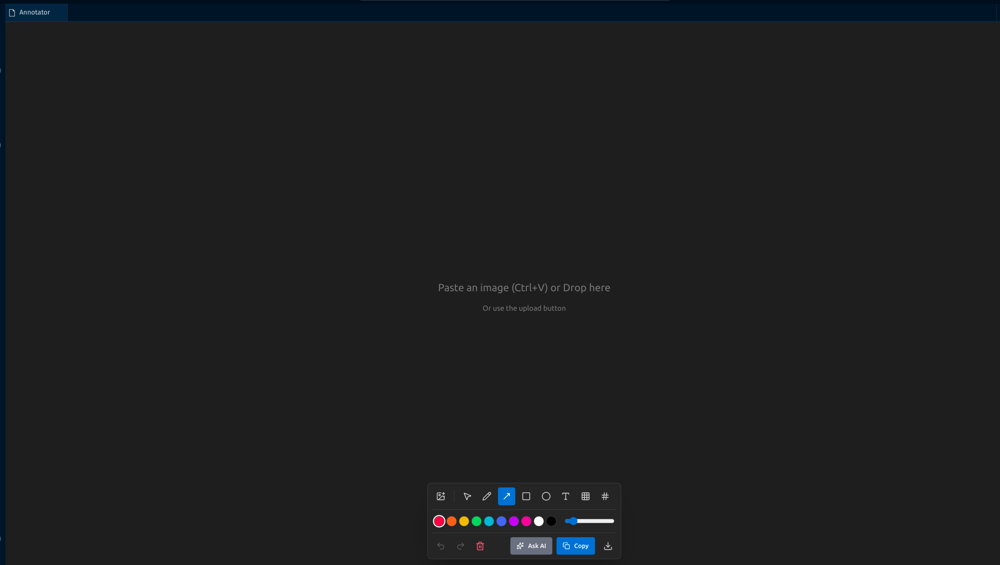

# Image Annotator

<div align="center">


**Annotate, Analyze, and Share Images without leaving VS Code.**

</div>



---

**Image Annotator** is a powerful VS Code extension designed to bridge the gap between visual context and code. Whether you're reporting a UI bug, documenting a complex architecture diagram, or asking AI for help with a visual layout, Image Annotator makes it seamless.

## ✨ Features

*   **🎨 Rich Annotation Tools:** Draw arrows, shapes, text, and sequences directly on images.
*   **🤖 AI-Powered Analysis:** Use Google's Gemini AI to find bugs, explain diagrams, or generate code from screenshots.
*   **🔒 Privacy First:** Redact sensitive info with blur tools. API keys are stored securely in VS Code.

---

## 🚀 Getting Started (Users)

### 1. Installation
Install "Image Annotator" from the VS Code Marketplace or download the `.vsix` from releases.

### 2. Setup API Key
To use AI features, you need a Gemini API Key:
1.  Get a free key at [Google AI Studio](https://aistudio.google.com/app/apikey).
2.  In VS Code, open **Settings** (`Ctrl+,`) and search for `Image Annotator`.
3.  Paste your key into the **Gemini Api Key** field.

### 3. Usage
*   **Open:** Press `Ctrl+Shift+P` and run `Annotate Image`, or right-click in any editor.
*   **Add Image:** Paste (`Ctrl+V`) or use the **Upload** button.
*   **Analyze:** Click **Ask AI** to get insights from Gemini.

---

## 🛠️ Development & Building (From Source)

Follow these steps to build the extension from source.

### Prerequisites
*   [Node.js](https://nodejs.org/) (v18+)
*   [VS Code](https://code.visualstudio.com/)
*   `vsce` (for packaging): `npm install -g @vscode/vsce`

### 1. Clone & Install
```bash
git clone https://github.com/onel0p3z/image-annotator.git
cd image-annotator
npm install
cd vscode-extension && npm install && cd ..
```

### 2. Build the Webview
The annotator UI is a React app. It must be built into a single file for the extension to consume:
```bash
npm run build
```
This generates `vscode-extension/webview-dist/index.html`.

### 3. Build the Extension
Compile the TypeScript extension host code:
```bash
cd vscode-extension
npm run compile
```

### 4. Run & Debug
1.  Open the root folder in VS Code.
2.  Press `F5` to launch a new **Extension Development Host** window.
3.  In the new window, use the command `Annotate Image` to test your changes.

### 5. Packaging
To create a `.vsix` file for manual installation:
```bash
cd vscode-extension
vsce package
```

---

**Enjoy building with visual context!**
